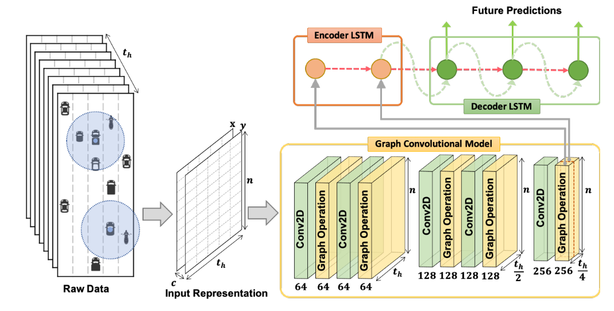
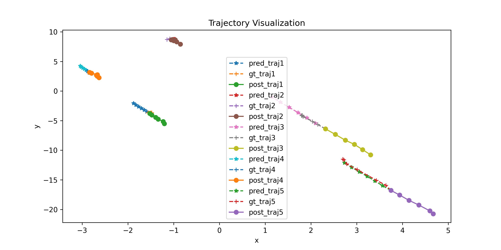

# 预测问题-多目标轨迹预测

## 模型介绍

项目介绍了名为GRIP++的增强型图基交互感知轨迹预测模型，旨在提高自动驾驶车辆在城市交通环境中的安全性。分为模型概述、模型架构和具体实现三个方面：

### 1. 模型概述

- **GRIP++目标**：之前的GRIP模型使用固定图来描述交通参与者之间的关系，但在城市交通场景中可能性能下降。GRIP++提出一个改进的方案，使用固定和动态图来预测不同类型的交通参与者（如车辆、行人、自行车等）的轨迹，以提高预测准确性并帮助避免交通事故。
- **性能表现**：在ApolloScape城市交通数据集上的评估显示，GRIP++在预测准确性上优于当时的先进方案，并且在2019年10月的ApolloScape轨迹竞赛中排名第一。

### 2. 模型架构

模型型整体分成三个部分，包括输入预处理模型、图卷积模型和轨迹预测模型，模型架构如下图



- **输入预处理模型**：将原始轨迹数据转换为转换为三个维度的数组，包括对象的数量、时间步长和坐标维度，为了简化预测任务，将位置信息转换为速度信息。
- **图卷积模型**：使用1x1卷积层增加数据通道，以映射到更高维的空间。通过多个图操作层和时间卷积层交替处理输入数据，以捕捉对象间的空间交互和时间动态特征。使用批量归一化和跳跃连接来提高模型的训练稳定性和性能。
- **轨迹预测模型**：采用多个Seq2Seq网络结构，每个网络都包含编码器和解码器GRU网络。输入图特征向量，并预测未来的位置坐标。通过残差连接强制模型预测速度变化，以提高预测的准确性。

### 3 .具体实现

- **数据集**：使用ApolloScape轨迹数据集进行评估，这些数据集包含了不同交通条件下车辆、行人和骑行者三类交通参与者的轨迹信息。
- **性能指标**：使用均方根误差（RMSE）和加权平均位移误差（WSADE）等指标来评估模型的预测性能。
- **优化**：使用Adam优化器进行训练，将模型作为一个回归任务来处理，并最小化损失函数。
- **可视化**：通过可视化预测结果，展示了GRIP++在不同交通条件下的预测能力，包括直道和弯道场景。

总的来说，GRIP++通过结合固定和动态图以及高效的编码器-解码器结构，提高了自动驾驶车辆在复杂城市环境中的轨迹预测能力，这对于提高自动驾驶的安全性和可靠性具有重要意义。

## 代码解读

### 0. 准备工作

- 设备要求：Windows/Linux环境下运行，预装Anaconda/Miniconda；
- 案例程序默认采用cpu训练，若有英伟达的独立显卡且配置好cuda核，则可修改部分设备相关代码，以实现采用独立显卡进行训练；
- 项目中给出了训练好的案例模型，即`All_prediction_demo/result/trained_models/model_epoch_0049.pt`

- 采用的ApolloScape的轨迹数据集数据量较小，代码中的data文件夹已经给出，不需要额外进行下载。

### 1. 环境配置

```bash
cd prediction_demo/
conda create --name grip python=3.8
conda activate grip

pip install torch
pip install numpy
pip install matplotlib
pip install torchvision
```

### 2.数据预处理

```python
train_file_path_list = sorted(glob.glob(os.path.join(data_path, 'prediction_train/*.txt')))
test_file_path_list = sorted(glob.glob(os.path.join(data_path, 'prediction_test/*.txt')))

print('Generating Training Data.')
generate_data(train_file_path_list, pra_is_train=True)

print('Generating Testing Data.')
generate_data(test_file_path_list, pra_is_train=False)
```

- `data_path`原始数据路径

### 3.模型训练

```python
graph_args={'max_hop':2, 'num_node':120}
model = Model(in_channels=4, graph_args=graph_args, edge_importance_weighting=True)
dev = torch.device("cpu")
model.to(dev)
run_trainval(model, trainval_data_path)
```

- `trainval_data_path`预处理好的训练和验证数据
- `max_hop`: 这个参数定义了在图卷积网络中考虑的最大的“跳数”（hop），也就是每个节点（即交通参与者）在图中可以直接或间接连接到的其他节点的范围。具体来说：
  - `max_hop=1` 表示每个节点只与它的直接邻居（一跳之内）交互。
  - `max_hop=2` 意味着每个节点不仅与直接邻居交互，还可以与邻居的邻居（两跳之内）交互，这可以捕捉到更远距离的交互关系。
- `num_node=120` 表示图中最多可以有120个节点，即模型一次最多处理120个交通参与者。

### 4.模型评估

```python
evaluate_model(model_path,trainval_data_path)
```

- `model_path`训练好的模型路径

- `trainval_data_path`预处理好的训练和验证数据

- 模型评估结果包括两种方式，一个常见的指标计算法方式，不区分预测的对象类别，统一计算ADE和FDE；还一个是ApolloScape挑战赛中的指标计算方式，即分别计算三类交通参与者的ADE和FDE指标后夹权平均，公式为

$$
WSADE = 0.2*ADE_v+0.58*ADE_p+0.22*ADE_b \\
WSFDE = 0.2*FDE_v+0.58*FDE_p+0.22*FDE_b \\
$$

其中，下标$v,p,b$分别表示车辆、行人和骑行者

### 5.部分场景可视化

```python
visulization(model_path,trainval_data_path,indx=10,visualize_path=visualizepred_path)
```

- `model_path`训练好的模型路径
- `trainval_data_path`预处理好的训练和验证数据
- `indx`需要可视化的验证场景的索引号
- `visualize_path`可视化结果的保存位置
- 可视化结果仅绘制一个场景中的前5条轨迹，超过部分不绘制

### 6.预测测试

```python
run_test(model_path, test_data_path,testresult_path)
```

- `model_path`训练好的模型路径
- `test_data_path`预处理好的数据位置
- `testresult_path`保存预测结果路径
- 测试数据没有真值，仅能查看预测结果

## 完整demo

```python
import glob
import os 
import torch
from preprocess import generate_data
from train import run_trainval
from model.model import Model
from evaluate import evaluate_model
from visualize import visulization
from test import run_test

batch_size_train = 64 
batch_size_val = 32

data_path = 'data'
model_path = 'result/trained_models/model_epoch_0049.pt'
processd_data_path = 'result/processed_files'
visualizepred_path = 'result/visulize_val'
testresult_path = 'result/test_result'

trainval_data_path=os.path.join(processd_data_path, 'train_val_data.pkl')
test_data_path=os.path.join(processd_data_path, 'test_data.pkl')

# 数据与预处理
train_file_path_list = sorted(glob.glob(os.path.join(data_path, 'prediction_train/*.txt')))
test_file_path_list = sorted(glob.glob(os.path.join(data_path, 'prediction_test/*.txt')))

print('Generating Training Data.')
generate_data(train_file_path_list, pra_is_train=True)

print('Generating Testing Data.')
generate_data(test_file_path_list, pra_is_train=False)


# 训练模型
graph_args={'max_hop':2, 'num_node':120}
model = Model(in_channels=4, graph_args=graph_args, edge_importance_weighting=True)
dev = torch.device("cpu")
model.to(dev)
run_trainval(model, trainval_data_path)


# 数据评估指标计算
evaluate_model(model_path,trainval_data_path)


# 可视化
visulization(model_path,trainval_data_path,indx=10,visualize_path=visualizepred_path)


# 测试数据
run_test(model_path, test_data_path,testresult_path)
```


